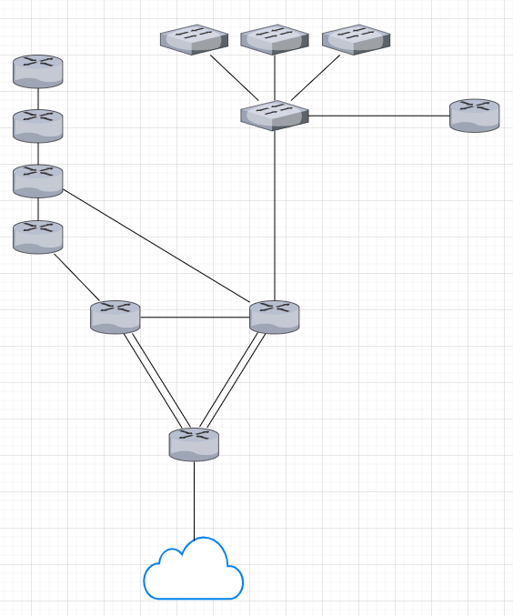

# NetworkNarcotic
A tool for automatically plotting networks in GNS3 based on text input.

Reading this README will allow you to perfectly understand and use NetworkNarcotic.

## Description
Current procedure on how to use NetworkNarcotic:
1) Manually build the input .yaml file
2) Feed this input file to the NetworkNarcotic engine (Python script)
    * The engine applies its algorithm against the input file:
        * checking for syntax errors,
        * checking for logic errors,
        * building the network topology in memory,
        * serializing this network topology into a .gns3 project file,
        * and producing an Ansible inventory file for the entire network.

In the end, you will have a usable network in GNS3 against which you can apply Ansible plays for further configuration. 

With NetworkNarcotic still being a prototype, the procedure up above is a little on the crude side and will probably be streamlined in the future, perhaps adding a GUI. That aside, it currently also only supports IPv4.

## Expectations
The core idea behind NetworkNarcotic is to **save time** when plotting networks. Input files are relatively straightforward and writing them can be learned quickly. However, since nothing can (as of yet) truly substitute for human intelligence, NetworkNarcotic must make some assumptions about the network you desire. Any 'gaps' in the information you provide, the tool will try to fill in on its own. These decisions are made in a systematic and predictable manner, but in the end, remain out of reach for the user. 

**In automation, there is always a balance between precision and the amount of time saved.**

## Example input file
```
---
input:
  connections:
    - tag: conn_A
      ipsummary: 10.1.0.0/16
      connectionmode: full
      cables: 2

    - tag: conn_B
      ipsummary: 10.2.0.0/16
      connectionmode: parallel

    - tag: conn_C
      switches:
        - tag: swit_A
          amount: 4
          clustermode: hubspoke
          ipsummary: 192.168.1.0/24

  routers:
    - tag: rout_A
      gateway: true
      connectedto:
        - conn_A

    - tag: rout_B
      amount: 2
      ipsummary: 10.3.0.0/16
      connectedto:
        - conn_A
        - conn_B
        - conn_C

    - tag: rout_C
      amount: 4
      ipsummary: 10.4.0.0/16
      clustermode: line
      connectionshift: 1
      connectedto:
        - conn_B

    - tag: rout_D
      connectedto:
        - conn_C
```



As seen in the picture,
* encircled red are router clusters,
* encircled green is a switch cluster in connection 'C,'
* IP summarization is applied in the router clusters and connections.


## How to write input files
### **Important before you continue**
NetworkNarcotic input files work with a concept called _clusters_. A cluster is simply a unit of one or more devices. In the example input file up above, you can find 4 router clusters and 1 switch cluster. Clusters and where to find them in an input file:

- Router clusters reside in the **routers** variable.
- Switch clusters reside in a connection definition of the **connections** variable.

You can use a connection if you want to connect clusters to each other or connect a stub network to a router. These connections can be direct (one-to-one) or contain switches, in which case a switch cluster needs to be added inside the desired connection definition. If more than 2 router clusters need to be connected, the connection definition should contain a switch cluster.

The way clusters and connections are cabled depends on the variables **clustermode** and **connectionmode**. They're similar but cannot be used interchangeably. If no clustermode variable is defined in a cluster, the default value will be used (in this case 'full'). The same mechanism applies to the connectionmode variable, among others.

Lastly, it's important to know that every device in a cluster (whether router or switch) receives a linearly assigned ID upon creation. Refer to the example network up above to see the ID's written on the devices. A cluster with 5 devices has ID's 1 to 5. ID's are unique within a cluster and are used by the **connectionmode** variable to:

* decide which device to select,
* or to break ties when devices get selected in some other way. 

ID = 1 has the highest priority and will always be selected first. Connectionmode values that require device ID's are marked down below with an **\* asterisk**.

### **Variables: YAML structure**

```
---
input:
   connections:
      - tag: ...
        cables: ...
        connectionmode: ...
        ipclass: ...
        ipsummary: ...
        shiftable: ...
        switches:
          - tag: ...
            amount: ...
            cables: ...
            clustermode: ...
            connectionshift: ...
            ipclass: ...
            ipsummary: ...
   routers:
      - tag: ...
        amount: ...
        cables: ...
        clustermode: ...
        connectedto:
          - ...
        connectionshift: ...
        gateway: ...
        ipclass: ...
        ipsummary: ...
        routing: ...
```

### **Variables: values**

> **input:**

    The global object that defines the input file. Cannot be omitted.

> **amount:** <**1** (default) | number between 1 and 255>

    Influences the amount of devices in a cluster.

> **cables:** <**1** (default) | number between 1 and 3>

    Influences the Etherchannel/Port Channel configuration in a cluster or connection.

> **clustermode:** <**full** (default) | **loop** | **line** | **hubspoke**>

    Influences the cable layout of a cluster.

    > full        full mesh topology, every device is connected to every other device
    > loop        loop topology, devices are connected in a loop
    > line        line topology, basically loop mode with a cut in it
    > hubspoke    hub-and-spoke topology, every device is connected to one central device (ID = 1)
    > ...         (more to come)

> **connections:**

    Opens a connections variable which contains connection definitions.

> **connectionmode:** <**single** (default) | **full** | **parallel** | **spread**>

    Influences the cable layout of a connection.

    > single *    a single cable is applied between ONE device from each cluster
    > full        every device in one cluster is connected to every device in the other cluster
    > parallel *  multiple cables are applied between parallels of devices from all clusters 
                  until the smallest cluster is exhausted
    > spread      multiple cables are applied as far from each other as possible between devices
                  from all clusters until the smallest cluster is exhausted
    > ...         (more to come)

> **connectionshift:** <**0** (default) | number between 0 and 255>

    Influences the starting point of a connection's cabling algorithm for a cluster. With 
    connectionmode = full, the connectionshift variable has no effect. This variable has a 
    circular nature and overflow will start back at the device with ID = 1.

> **gateway:** <**false** (default) | **true**>

    Influences whether or not a router cluster is hooked to the escape network.

> **ipclass:** <**A** (default) | **B** | **C**>

    Influences the used private address space.

    > A       10.0.0.0 - 10.255.255.255
    > B       172.16.0.0 - 172.31.255.255
    > C       192.168.0.0 - 192.168.255.255

> **ipsummary:** <**auto** (default) | IP address in CIDR notation> 

    Influences the used address space in a cluster or connection. When applied to multiple 
    networks (for example a cluster with 3+ routers) NetworkNarcotic will use the supplied 
    variable value as a summary and select the most economical address spaces to achieve 
    connectivity.

    > auto                          let NetworkNarcotic decide all IP addresses on its own    
                                    (first tries DHCP, then the address space of the environment 
                                    the variable is applied in, lastly the ipclass variable)
    > IP address in CIDR notation   manually pick the address space

> **routers:**

    Opens a routers variable which contains router cluster definitions.

> **routing:** <**static** (default)>

    Influences how routers in the network or a cluster fill their forwarding tables. OSPF/EIGRP/
    IS-IS may be added later. Each routing variable treats the area it affects as a domain.

> **shiftable:** <**true** (default) | **false**>

    Influences whether or not a connection is susceptible to the connectionshift variable when 
    connected to a cluster.

> **switches:**

     Opens a switches variable which contains switch cluster definitions. This is always done 
     inside a connection definition. This variable cannot be combined with an internet variable 
     in the same connection.
