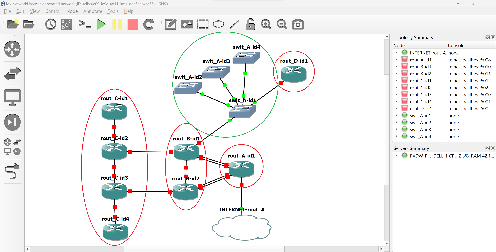

# NetworkNarcotic
A tool for automatically plotting networks in GNS3 based on text input.

Reading this README will allow you to perfectly understand and use NetworkNarcotic.

## Description
Current procedure on how to use NetworkNarcotic:
1) Manually build the input .yaml file
2) Feed this input file to the NetworkNarcotic engine (Python script)
    * The engine applies its algorithm against the input file:
        * checking for syntax errors,
        * checking for logic errors,
        * building the network topology in memory,
        * serializing this network topology into an output .yaml file,
        * and producing an Ansible inventory file for the entire network.
3) Feed this output .yaml file to the NetworkNarcotic GNS3 plugin

In the end, you will have three items: 
* your original input .yaml file,
* an output .yaml file,
* and a usable network in GNS3 against which you can apply Ansible plays for further configuration. 

With NetworkNarcotic still being a prototype, the procedure up above is a little on the crude side and will probably be streamlined in the future, perhaps adding a GUI. That aside, it currently also only supports IPv4.

## Expectations
The core idea behind NetworkNarcotic is to **save time** when plotting networks. Input files are relatively straightforward and writing them can be learned quickly. However, since nothing can (as of yet) truly substitute for human intelligence, NetworkNarcotic must make some assumptions about the network you desire. Any 'gaps' in the information you provide, the tool will try to fill in on its own. These decisions are made in a systematic and predictable manner, but in the end, remain out of reach for the user. 

**In automation, there is always a balance between precision and the amount of time saved.**

## Example input file and the network it produces
```
---
clustermode: full
connectionmode: single
ipsummary: auto
cables: 1
cabletype: auto
ipclass: C
connectionshift: 0
routing: static

connection:
  tag: 'A'
  ipsummary: 10.1.0.0/16
  connectionmode: full
  cables: 2

connection:
  tag: 'B'
  ipsummary: 10.2.0.0/16
  connectionmode: exhaust

connection:
  tag: 'C'
  switch:
    amount: 4
    clustermode: hubspoke
  ipsummary: 192.168.1.0/24
  connectionmode: single

router:
  amount: 1
  connection: 'A'
  internet:
    ipsummary: 165.25.32.15/32

router:
  amount: 2
  connection: 
    - 'A'
    - 'B'
    - 'C'
  iprange: 10.3.0.0/16

router:
  amount: 4
  connection: 'B'
  ipsummary: 10.4.0.0/16
  clustermode: line

router:
  amount: 1
  connection: 'C'
```



As seen in the picture,
* encircled red are router clusters,
* encircled green is a switch cluster in connection 'C,'
* IP summarization is applied in the router clusters and connections.


## How to write input files
### **Important before you continue**
NetworkNarcotic input files work with a concept called **clusters**. A cluster is a unit of one or more devices. In the example input file up above, you can find 4 router clusters and 1 switch cluster. Router clusters reside on the highest .yaml level, while switch clusters always reside inside a **connection** variable.

You can use a connection if you want to connect clusters to each other or connect a stub network to a router. These connections can be direct (one-to-one) or contain switches, in which case a switch cluster needs to be added inside the desired connection variable. If more than 2 router clusters need to be connected, the connection variable should contain a switch cluster. A connection can be defined inside a router cluster, but be aware: the other router cluster will need the **exact same** connection definition. In order to avoid repeating yourself, it's better to define connections on a global level and refer to their tag in the router clusters.

The way clusters and connections are internally cabled depends on the variables **clustermode** and **connectionmode**. They're similar but cannot be used interchangeably. If no clustermode variable is defined in a cluster, the global clustermode variable will be used. If no global clustermode variable is defined, the default value will be used (in this case 'full'). The same mechanism applies to the connectionmode variable, among others.

### **Variables**
> **clustermode:** <**full** (default) | **single** | **loop** | **hubspoke**>

    Influences the cable layout of a cluster.

    > full        full mesh topology, every device is connected to every other device
    > loop        loop topology, devices are connected in a loop
    > line        line topology, basically loop mode with a cut in it
    > hubspoke    hub-and-spoke topology, every device is connected to one central device
    > ...         (more to come)

> **connectionmode:** <**single** (default) | **full** | **exhaust**>

    Influences the cable layout of a connection.

    > single    a single cable is applied between ONE device from each cluster
    > full      every device in one cluster is connected to every device in the other cluster
    > exhaust   multiple cables are applied between PARALLELS of devices from all clusters 
                until the smallest cluster is exhausted
    > ...       (more to come)

> **ipsummary:** <**auto** (default) | IP address in CIDR notation> 

    Influences the used address space in a cluster or connection. When applied to multiple 
    networks (for example a cluster with 3+ routers) NetworkNarcotic will use the supplied 
    variable value as a summary and select the most economical address spaces to achieve 
    connectivity.

    > auto                          let NetworkNarcotic decide all IP addresses on its own (uses 
                                    class A private addresses or uses the address space of the 
                                    environment the variable is applied in)
    > IP address in CIDR notation   manually pick the address space

> **cables:** <**1** (default) | number between 1 and 3>

    Influences the Etherchannel/Port Channel configuration in a cluster or connection.

> **cabletype:** <**auto** (default) | **copper** | **fiber** | **serial**>

    Influences the type of cabling in a cluster or connection.

    > auto    let NetworkNarcotic decide all cabling types on its own (follows best practice)
    > copper  use copper cabling
    > fiber   use fiber cabling
    > serial  use serial cabling (not available for connections containing a switch)

> **ipclass:** <**A** (default) | **B** | **C**>

    Influences the used private address space.

    > A       10.0.0.0 - 10.255.255.255
    > B       172.16.0.0 - 172.31.255.255
    > C       192.168.0.0 - 192.168.255.255

> **connectionshift:** <**0** (default) | number between 0 and 255>

    Influences the starting point of a connection's cabling algorithm (connectionmode variable). 
    When NetworkNarcotic is building the network topology in memory, devices in a cluster 
    receive an ID (starting at 1, counting upwards) in the linear order they were created. This 
    ID is treated as their priority, with 1 being the highest. Connections respect this order 
    and always go for the device with ID = 1 first. With connectionmode = full, the 
    connectionshift variable has no effect. This variable has a circular nature and overflow
    will start back at the device with ID = 1.

> **shiftable:** <**true** (default) | **false**>

    Influences whether or not a cluster is susceptible to the connectionshift variable.
    
> **routing:** <**static** (default)>

    Influences how routers in the network fill their forwarding tables. OSPF/EIGRP/IS-IS may be added later.
